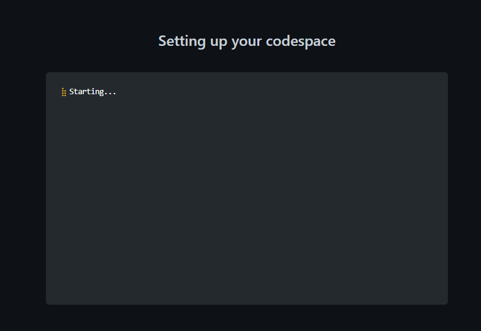
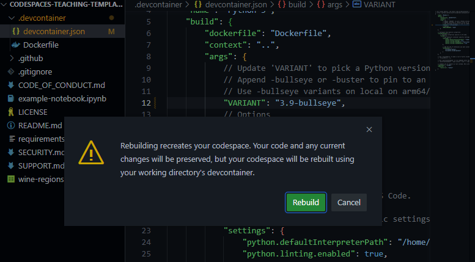

[](https://github.com/codespaces/new?hide_repo_select=true&ref=main&repo=526669888)

# Python Codespace Template

_Create or extend a ready-to-use repository for teaching Python in minutes_

With this template repository you can quickly create a normalized environment to teach or learn Python. Make your students focus on learning rather than setting up their environment. This template uses Codespaces, a development environment that's hosted in the cloud with [Visual Studio Code](https://visualstudio.microsoft.com/?WT.mc_id=academic-77460-alfredodeza), a powerful text editor.

🤔 Curious? Watch the following video where we explain all the details:

[](https://youtu.be/7rMvb03hHpI "Teaching Python with Codespaces")

<details>
   <summary><b>🎥 Watch the video tutorial to learn more about Codespaces</b></summary>
   
   [](https://aka.ms/CodespacesVideoTutorial "Codespaces Tutorial")
</details>

🚀 Codespaces features:

- Repeatable cloud environment offering a push-button experience.
- Can be configured and customized.
- Integrates with your repositories on GitHub and [VSCode](https://visualstudio.microsoft.com/?WT.mc_id=academic-77460-alfredodeza)

As a teacher that means that you can create an environment, in the cloud, for your class that all students can use with zero or next to zero configuration regardless of what operating system they are using.

## Customization

Customize your project for GitHub Codespaces by committing configuration files to your repository (often known as Configuration-as-Code), which creates a repeatable codespace configuration for all users of your project.

You can configure things like:

- Extensions, you can specify what extensions should be preinstalled.
- Dotfiles and settings.
- Operating system libraries and dependencies

> 💡 Learn more about [customization and configuration in the official documentation](https://docs.github.com/en/codespaces/customizing-your-codespace/personalizing-github-codespaces-for-your-account)


## Codespaces template

This repo is a GitHub template. It contains the following:

- [example-notebook.ipynb](./example-notebook.ipynb), This notebook uses the [Pandas](https://pandas.pydata.org/) library to teach basic operations with a small CSV (Comma Separated Value file) [dataset](./wine-regions.csv)
- [.devcontainer/Dockerfile](./.devcontainer/Dockerfile), So that you can configure what operating system the Codespace will use and how should the container be built.
- [.devcontainer/devcontainer.json](./.devcontainer/devcontainer.json), A configuration file used by Codespaces to configure [Visual Studio Code](https://visualstudio.microsoft.com/?WT.mc_id=academic-77460-alfredodeza), for example to add and enable an extension.
- `README.md`. This file describes this repository and what's in it.

### 🔎 Found an issue or have an idea for improvement? 
Help us make this template repository better by [letting us know and opening an issue!](/../../issues/new). 

## 🧐 Try it out

Try out this template repository using Codespaces following these steps:

1. Create a repo from this template. Use this [create repo link](https://github.com/microsoft/codespaces-teaching-template-py/generate)
1. Navigate to the main page of the newly created repository.
1. Under the repository name, use the Code drop-down menu, and in the Codespaces tab, select "Create codespace on main".
   
1. Creating codespace

   


### Inspect your codespaces environment

What you have at this point is a pre-configured environment where all the runtimes and libraries you need are already installed - a zero config experience.

You also have a Jupyter Notebook that you can start using without any configuration.

> This environment will run the same regardless of whether your students are on Windows, macOS or Linux.

Open up your Jupyter Notebook file [example-notebook.ipynb](./example-notebook.ipynb) and note how you can add code and run it.

## Customize the Codespace

Let's make changes to your environment. We'll cover two different challenges that you are likely to want to do:

1. Change the Python version installed
1. Add an extension


### Step 1: Change the Python environment

Let's say you want to change what version of Python is installed. This is something you can control.

Open [.devcontainer/devcontainer.json](./.devcontainer/devcontainer.json) and replace the following section:

```json
"VARIANT": "3.8-bullseye"
```

with the following instruction:

```json
"VARIANT": "3.9-bullseye"
```

this change will use Python 3.9 instead of 3.8.

### Step 2: Add an extension

Your environment comes with preinstalled extensions. You can change which extensions your codespaces environment starts with, here's how:

1. Open file [.devcontainer/devcontainer.json](./.devcontainer/devcontainer.json) and locate the following JSON element **extensions**:

   ```json
   "extensions": [
    "ms-python.python",
    "ms-python.vscode-pylance"
   ]
   ```

1. Add _"ms-python.black-formatter"_ to the list of extensions. It should end up looking like the following:

   ```json
   "extensions": [
    "ms-python.python",
    "ms-python.vscode-pylance",
    "ms-python.black-formatter"
   ]
   ```

   What you did above was to add the unique identifier of an extension of the Python [Black Formatter extension](https://marketplace.visualstudio.com/items?itemName=ms-python.black-formatter&WT.mc_id=academic-77460-alfredodeza). This will let Codespaces know that this extension should be pre-installed upon startup.

   Remainder: When you change any configuration on the json, a box will appear after saving.

   

   Click on rebuild. Wait for your codespace to rebuild the VS Code environment.


To find the unique identifier of an extension:

- Navigate to the extension's web page, for example [https://marketplace.visualstudio.com/items?itemName=ms-python.black-formatter](https://marketplace.visualstudio.com/items?itemName=ms-python.black-formatter&WT.mc_id=academic-77460-alfredodeza)
- Locate the *Unique Identifier* field under **More info** section on your right side.

## Learn more

- [GitHub Codespaces docs overview](https://docs.github.com/en/codespaces/overview)
- [GitHub Codespaces docs quickstart](https://docs.github.com/en/codespaces/getting-started/quickstart)

